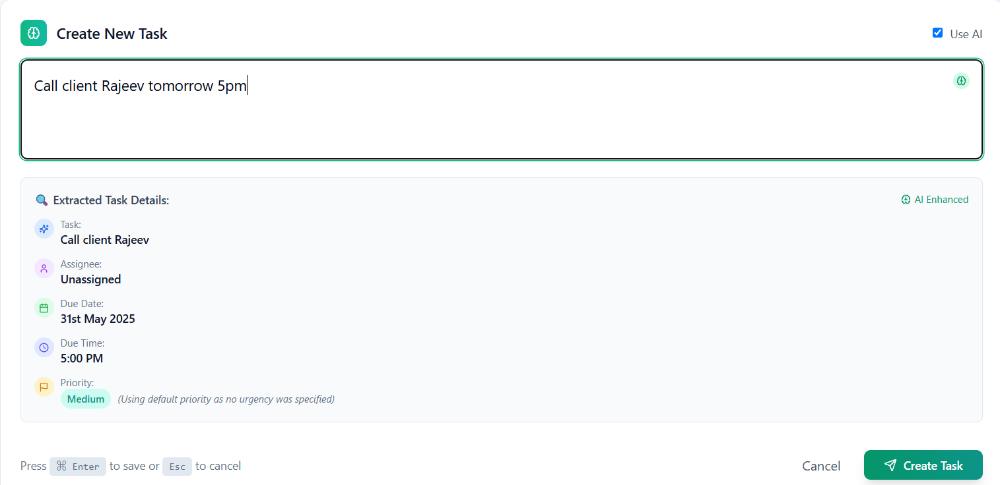
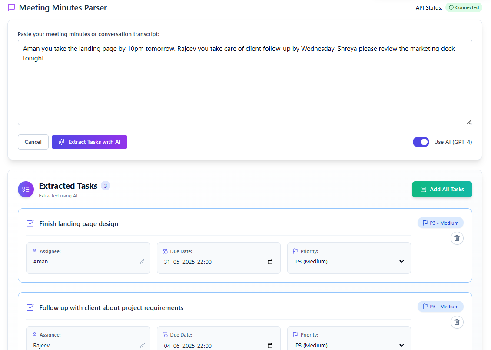
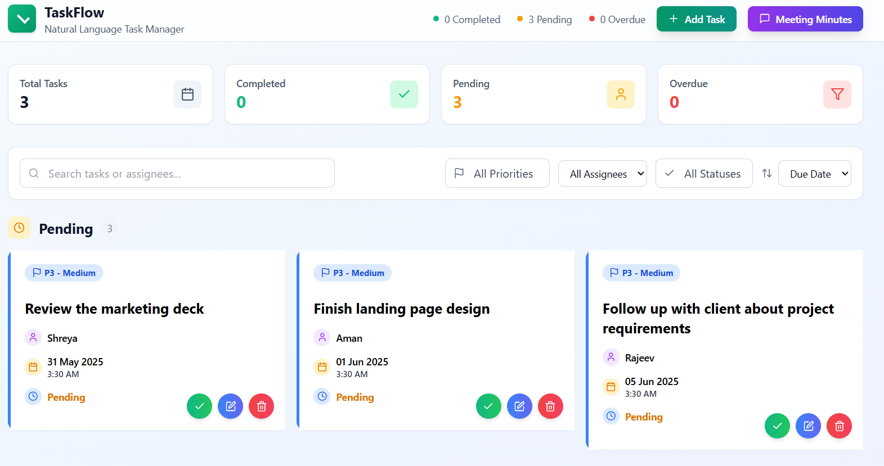

# TaskFlow - Natural Language Task Manager 📝

## Overview 🌟

TaskFlow is a modern task management application that uses natural language processing to intelligently parse and organize your tasks. Simply type your task in plain English, and TaskFlow will automatically extract key information like due dates, assignees, and priority levels.

## Screenshots 📸

### Single Task Creation with Natural Language Processing

TaskFlow allows you to create tasks effortlessly by typing in plain English. For example, inputting "Call client Rajeev tomorrow 5pm" will automatically parse the task title, identify the due date and time, and even suggest a priority if not explicitly mentioned.



### Meeting Minutes Parser for Multiple Tasks

Efficiently convert your meeting notes or conversation transcripts into actionable tasks. Paste your text, and TaskFlow's parser (either AI-powered or local) will extract multiple tasks, assignees, due dates, and priorities, ready to be added to your board.



### Task Dashboard for Easy Management

Get a clear overview of all your tasks on the dashboard. Tasks are neatly organized by status (Pending, In Progress, Completed), and you can quickly see key details like assignee, due date, and priority. Filters and search functionality help you find specific tasks with ease.



## Features ✨

- **Natural Language Processing**: Enter tasks in plain English (e.g., "Finish the report for Sarah by next Friday at 3pm with high priority").
- **AI-Powered Task Parsing**: Uses OpenAI's GPT model to intelligently extract task details.
- **Meeting Minutes to Task Converter**: Extract multiple tasks from meeting transcripts or conversation text.
- **Local NLP Fallback**: Built-in NLP parser works even without an API key.
- **Smart Date Handling**: Automatically sets dates to the future when no year is specified.
- **Priority Management**: Automatically assigns and color-codes priority levels (P1-P4).
- **Task Filtering**: Filter tasks by assignee, priority, status, or search terms.
- **Task Sorting**: Sort by due date, priority, or assignee.
- **Comprehensive Task Editing**: Edit all task properties with an intuitive modal interface.
- **Responsive Design**: Works beautifully on both desktop and mobile devices.
- **Local Storage**: Tasks are saved in your browser's local storage.
- **Modern UI**: Clean design with smooth animations and transitions.

## Technology Stack 💻

- **Frontend**: React with TypeScript
- **Styling**: TailwindCSS for responsive design
- **State Management**: React Hooks and Context API
- **AI Integration**: OpenAI API (optional)
- **Routing**: React Router
- **Build Tool**: Vite

## Getting Started 🚀

### Prerequisites

- Node.js (v16 or higher)
- npm or yarn

### Installation

```bash
# Clone the repository
git clone https://github.com/lokeshpanthangi/Natural-Language-Task-Manager.git

# Navigate to the project directory
cd Natural-Language-Task-Manager

# Install dependencies
npm install

# Start the development server
npm run dev
```

### OpenAI API Configuration (Optional) 🔑

TaskFlow can use OpenAI's GPT model for enhanced natural language processing. To enable this feature:

1. Create a `.env` file in the project root
2. Add your OpenAI API key: `VITE_OPENAI_API_KEY=your_api_key_here`

If no API key is provided, TaskFlow will automatically fall back to its built-in NLP parser.

## Usage 🛠️

### Single Task Entry
1. Click the "Add Task" button to create a new task
2. Type your task in natural language (e.g., "Call John about the project proposal tomorrow at 2pm")
3. Toggle the "Use AI" switch if you want to use OpenAI for parsing (requires API key)
4. TaskFlow will automatically extract the title, assignee, due date, and priority
5. Press Ctrl+Enter or click Submit to add the task

### Meeting Minutes Parser
1. Click the "Meeting Minutes" button to open the meeting minutes parser
2. Paste your meeting transcript or conversation text into the textarea
3. Click "Parse Meeting Minutes" to extract tasks
4. Review and edit the extracted tasks as needed
5. Click "Add All Tasks" to add them to your task board

## Key Components 🧩

- **TaskInput**: Handles natural language input and parsing for single tasks
- **MeetingMinutesParser**: Extracts multiple tasks from meeting transcripts
- **TaskList**: Displays and manages tasks
- **TaskCard**: Displays individual tasks with editing capabilities
- **TaskEditModal**: Provides comprehensive task editing interface
- **TaskFilters**: Provides filtering and sorting options
- **NLP Parser**: Local natural language processing
- **Meeting Minutes Parser**: Extracts tasks from conversational text
- **OpenAI Service**: Integration with OpenAI API for enhanced parsing

## Acknowledgments 🙏

- [OpenAI](https://openai.com/) for their powerful language models
- [React](https://reactjs.org/) and [Vite](https://vitejs.dev/) for the frontend framework
- [TailwindCSS](https://tailwindcss.com/) for the styling

---

Created by [Lokesh Panthangi](https://github.com/lokeshpanthangi)

## What technologies are used for this project? 💡

This project is built with:

- Vite
- TypeScript
- React
- shadcn-ui
- Tailwind CSS


Made with ❤️ by Nani